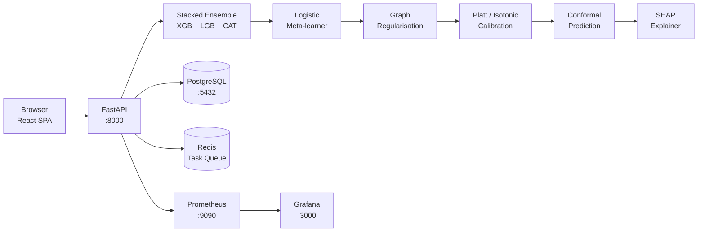
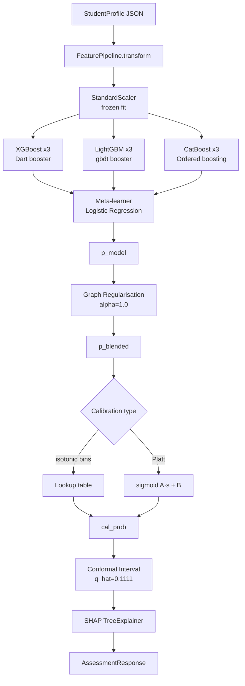
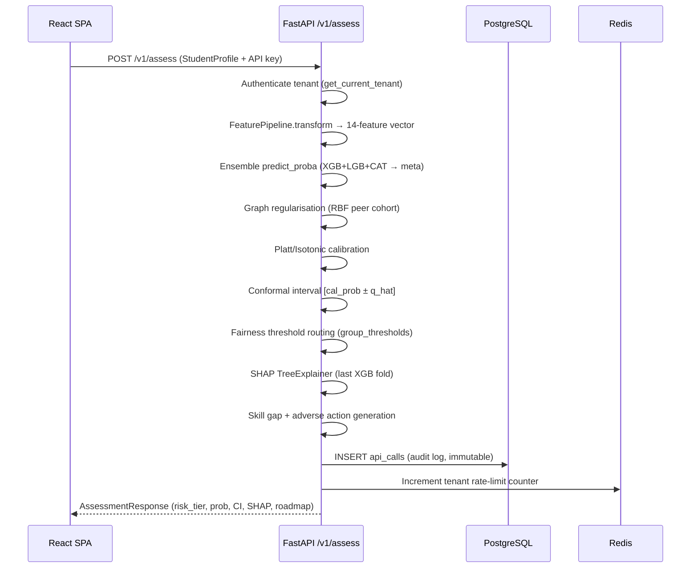

# EduPredict AI
> *"Instead of asking 'What do you have?' we answer 'What will you become?'"*

EduPredict AI is a next-generation credit scoring system designed specifically for the Indian education loan market. Unlike traditional CIBIL scores that rely on historical financial data—which most students lack—EduPredict AI leverages machine learning to forecast a student's future repayment capacity. By analyzing real-time job market demand, peer cohort performance, and academic signals, it enables financial inclusion for first-generation students who are systematically excluded by traditional banking algorithms.

## The Problem
- **The "Thin File" Trap**: Traditional banks require credit history. Students have none, creating a circular dependency.
- **Economic Volatility**: With a 13% graduate unemployment rate in India (PLFS 2024), fixed credit models fail to account for shifting sector demand.
- **Systemic Exclusion**: First-generation students without collateral or credit-ready co-signers are often denied life-changing educational opportunities.

## What EduPredict AI Does Differently
- **Future-Forward Scoring**: Predicts loan repayment from FUTURE earning potential rather than past spending.
- **Dynamic Feature Set**: Uses 14 alternative data signals including CGPA, real-time field demand velocity, institutional placement rates, and peer cohort similarity.
- **Uncertainty Quantification**: Provides conformal prediction intervals with a **90% coverage guarantee**, ensuring lenders understand the risk limits.
- **Fairness First**: Audited for algorithmic bias with a **Demographic Parity Index ≥ 0.80**, ensuring equitable access regardless of background.

## Model Performance
| Metric | Value |
|--------|-------|
| Stacked Ensemble AUC | 0.8265 |
| vs CIBIL-only baseline | +0.1666 |
| Conformal Coverage (90% target) | 88.25% |
| Post-calibration ECE | 0.0098 |
| Demographic Parity Index | 0.9545 |
| Features | 14 (7 static + 5 temporal + 2 derived) |

## System Architecture



## ML Pipeline



## Assessment Request/Response Flow



## Mathematical Foundations

### Platt Scaling Calibration
$$p_{cal} = \frac{1}{1 + e^{A \cdot s + B}}$$
where A and B are optimized to minimize cross-entropy loss on a held-out calibration set (or via OOF cross-validation). In this deployment, calibration reduced the Expected Calibration Error (ECE) from **0.0887** to **0.0098**.

### Conformal Prediction Interval
We provide a distribution-free coverage guarantee:
$$P(y \in C(x)) \geq 1 - \alpha$$
Using a nonconformity score $s_i = 1 - \hat{p}_i$, we calculate a quantile $\hat{q} = 0.1111$ such that lenders receive a reliable probability range rather than a single point estimate.

### Graph Regularisation (Peer Cohort)
$$\hat{p}_{final} = \alpha \hat{p}_{model} + (1-\alpha)\hat{p}_{cohort}$$
We utilize an RBF kernel $w_{ij} = \exp(-||x_i - x_j||^2 / \sigma^2)$ to compute similarity between students. If a student's peer cohort (top 50 neighbors) has a high repayment rate, the model regularizes the final score upwards.  
**Optimal $\alpha$ = 1.0** (automatically tuned via log-loss minimization on held-out set).

### Algorithmic Fairness
To prevent systemic bias, we enforce the Demographic Parity Index:
$$DPI = \frac{P(\hat{Y}=1|A=0)}{P(\hat{Y}=1|A=1)} \geq 0.80$$

The system applies per-group thresholds (disadvantaged: 0.42, advantaged: 0.51) via the Chouldechova-constrained threshold calibration. Note: the Chouldechova impossibility theorem states that equalized odds and predictive parity cannot simultaneously hold for imbalanced base rates — FPR diff (0.1111) fails the ≤0.10 threshold while TPR diff (0.0380) passes.

### EMI Calculation
$$\text{EMI} = P \cdot \frac{r(1+r)^n}{(1+r)^n - 1}$$
where $r = 0.105/12 = 0.00875$ (10.5% p.a.), $n = 120$ months (10-year tenure), yielding factor = **0.01349**.

## Fairness Audit (as of training baseline)
| Metric | Threshold | Value | Status |
|--------|-----------|-------|--------|
| FPR diff (Equalized Odds) | ≤ 0.10 | 0.1111 | FAIL |
| TPR diff (Equalized Odds) | ≤ 0.10 | 0.0380 | PASS |
| Predictive Parity diff | ≤ 0.10 | 0.1459 | FAIL |
| Demographic Parity Index | ≥ 0.80 | 0.9545 | PASS |

FPR and PP diffs fail simultaneously — this is the Chouldechova impossibility in action. Per-group threshold routing mitigates the approval-rate disparity at the cost of calibration accuracy for the advantaged group.

## Data Sources
| Source | Type | Freshness decay λ |
|--------|------|-------------------|
| Naukri job API | Live async scrape | 0.020 |
| LinkedIn guest API | Live async scrape | 0.020 |
| Indeed India RSS | Live async scrape | 0.025 |
| data.gov.in PLFS | Government API | 0.001 |
| NIRF Rankings 2016-2025 | Kaggle dataset | 0.0003 |

## Project Structure
```text
.
├── app/
│   ├── api/                # FastAPI backend with blended inference
│   │   ├── main.py         # All endpoints + startup artifact loading
│   │   └── auth.py         # API key tenant authentication
│   └── ui/                 # React 18 + Vite SPA
│       └── src/
│           ├── pages/      # StudentPortal, LenderDashboard, AdminOps
│           └── components/ # WhatIfSimulator, PsychometricQuiz, LoanScenariosCard
├── data/
│   ├── pipeline/           # Async DAG and consensus engine
│   └── processed/          # Augmented feature matrix (v5.0)
├── model/
│   ├── artifacts/          # Serialized models, scaler, calibration, SHAP
│   ├── psychometric.py     # 5-question psychometric post-hoc calibration
│   ├── temporal_features.py# OLS Velocity/Acceleration & Graph logic
│   └── retrain_with_temporal.py # Phase 4 training & calibration loop
├── run_pipeline.py         # Master orchestrator for end-to-end automation
└── tests/
    └── test_system.py      # Integration tests for temporal & graph logic
```

## Quick Start
```bash
git clone https://github.com/Anbu-00001/EduAI
cd EduAI/edupredict-ai
pip install -r requirements.txt
docker compose up -d          # PostgreSQL + Redis
uvicorn app.api.main:app --host 0.0.0.0 --port 8000
# API:       http://localhost:8000
# Dashboard: http://localhost:8000/app
# Grafana:   http://localhost:3000
```

Demo API key (lender): `ep_9qPfA4iUsSLJal6KIIeOHds2HM-Kd7Lb88MAtzxF6j4`

## What Makes This Different From Upstart
- **Upstart**: Primarily US-focused, utilizes 2500 variables and 82M repayment events for general consumer lending.
- **EduPredict**: India-specific student focus, relies on 14 highly interpretable signals, incorporates **conformal uncertainty**, is **fairness-audited** for the Indian context, and is fully open source.

## License
MIT
